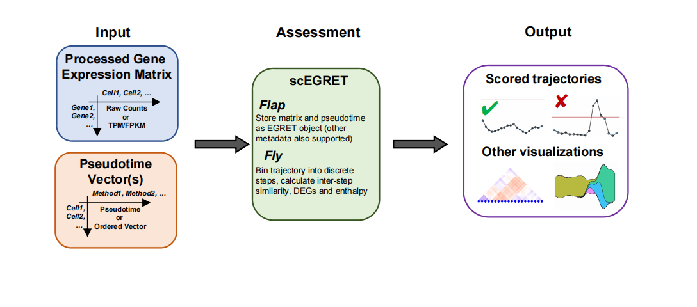
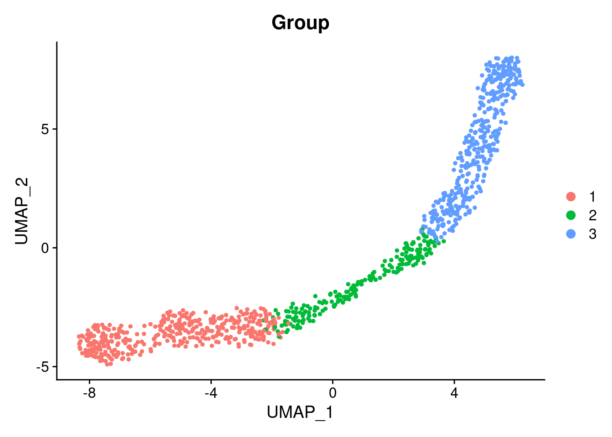
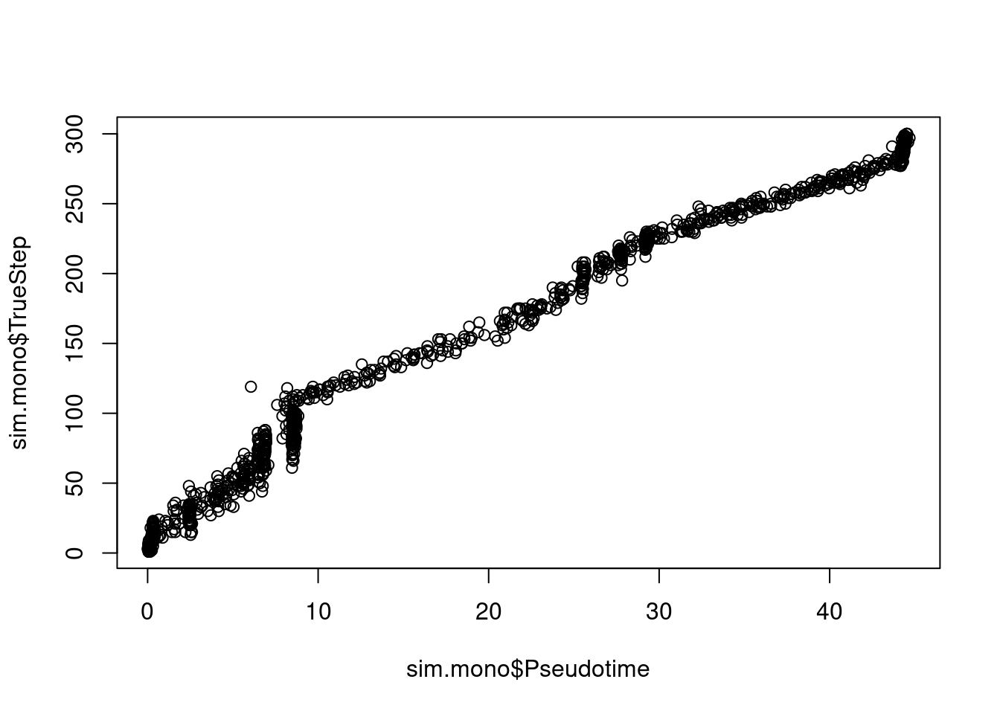
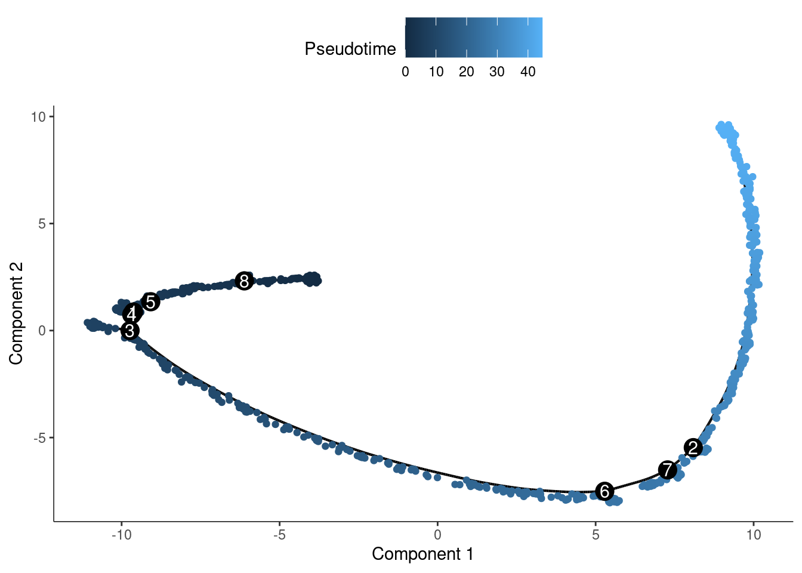
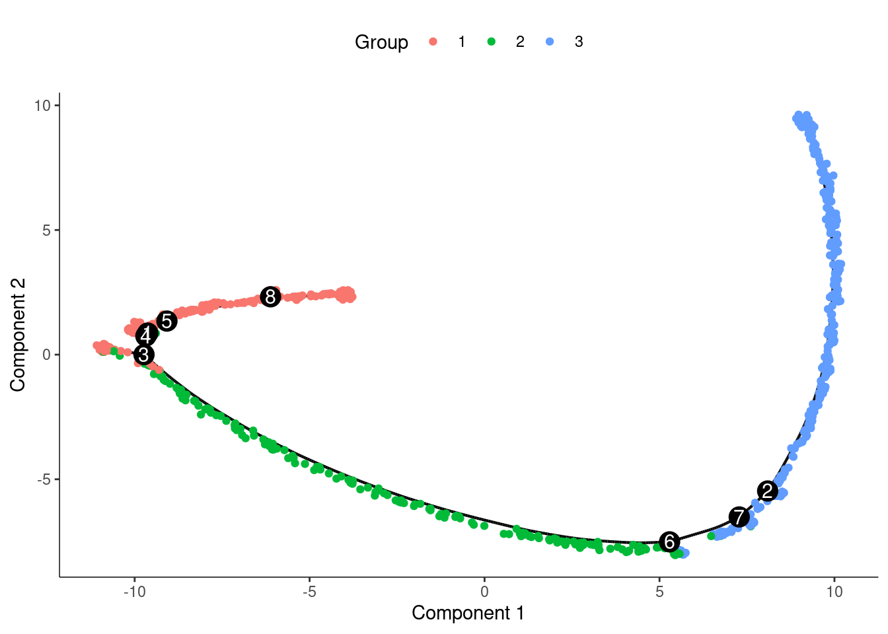
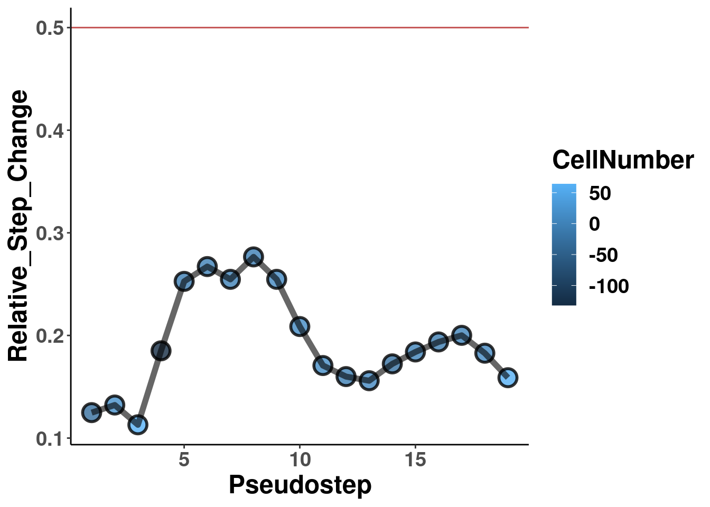
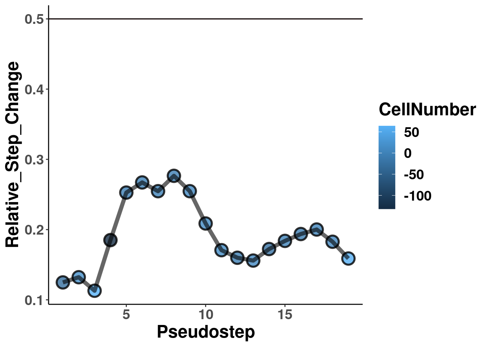
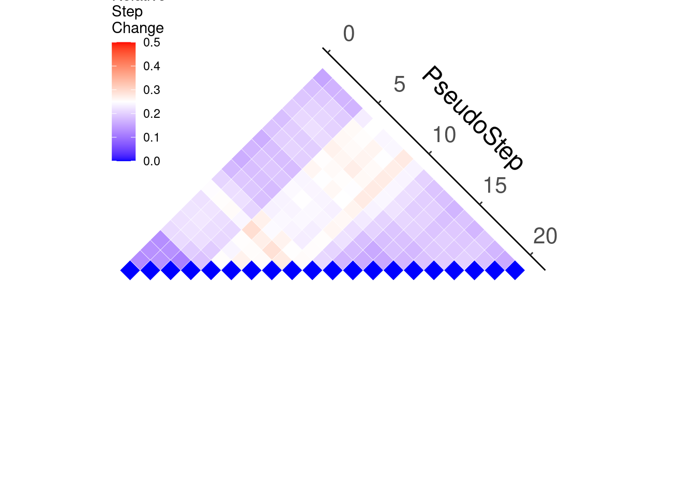

## EGRET: a simple method for trajectory evaluation 

An R package for evaluating the continuity of inferred single-cell trajectories using multiple metrics, including differential gene expression testing, average expression correlation, and gene expression enthalpy. Associated visualizations for pairwise bin comparisons are included. May be useful for selecting trajectories for downstream validation in complex biological systems, as well as comparisons of trajectories inferred by different algorithms. 

<p align="center">
  
</p>


## Installation

To install from GitHub:
```
library(devtools)
install_github("qingshanni/scEGRET", dependencies = T)
```

## An introduction to scEGRET package

As a demonstration, we have included here a full walkthrough in which we start from a gene expression matrix, calculate a pseudotime trajectory, and then assess the trajectory using scEGRET. In this exercise, we will show how our assessment can interact with single-cell data stored as a Seurat object, and trajectories calculated using monocle2. However, alternative trajectories calculated using other packages(e.g. slingshot), and other forms of single-cell data objects (e.g. SingleCellExperiment)  can also be used, as long as the relevant data slots can be accessed and loaded.

Load libraries
```
library(Seurat)
library(monocle)
library(scEGRET)
```

We will analyze a simulated dataset, stored inside the package, containing 1,000 cells and 10,000 genes. This dataset has been simulated using splatter as three distinct groups falling along a single, simple linear trajectory.

Create a Seurat object 
```
sim.seur <- CreateSeuratObject(counts = sim.expr,
                               meta.data = sim.meta)
```

We can first visualize what this dataset looks like using UMAP by processing it through Seurat with default parameters. 

```
sim.seur <- NormalizeData(sim.seur)
sim.seur <- FindVariableFeatures(sim.seur, nfeatures = 3000)
sim.seur <- ScaleData(sim.seur)
sim.seur <- RunPCA(sim.seur)
sim.seur <- RunUMAP(sim.seur, reduction = 'pca', dims = 1:30)
```

We can see that the three groups fall into three continuous, but non-overlapping, sections of a single arc-like shape in UMAP.

```
DimPlot(sim.seur, group.by = 'Group')
```
<p align="center">
  
</p>

To continue our analysis, we then infer a pseudotime trajectory for this dataset using monocle2. For convenience, we have included two wrapper functions for processing.

```
sim.mono <- seurat2Monocle(sim.seur)
sim.mono <- RunMonocle2(sim.mono, 
                varGenes = sim.seur@assays$RNA@var.features)
plot(sim.mono$Pseudotime, sim.mono$TrueStep)
```
<p align="center">
  
</p>

We can also visualize how this looks in monocle2 itself.

```
plot_cell_trajectory(sim.mono, color_by = 'Pseudotime')
```

<p align="center">
  
</p>

```
sim.mono$Group <- as.factor(sim.mono$Group)
plot_cell_trajectory(sim.mono, color_by = 'Group')
```
<p align="center">
  
</p>

We can now move onto scEGRET to assess the continuity of this trajectory,We first collect the relevant data from their respective slots.

```
input.pseudotime <- sim.mono$Pseudotime
input.df <- as.data.frame(sim.seur@assays$RNA@counts)
input.meta <- sim.seur@meta.data
```

...and now we can generate a scEGRET with a flap of its wings
```
sim.egret <- egret.flap(df = input.df,
                        metadata = input.meta,
                        pseudotimes = input.pseudotime)
```
Calculations can be run using a single command. we recommend using the rice rule for histogram bin number to determine the number of bins to set of course, one should explore the impact of modifying this parameter on their own dataset prior to making a final determination

```
sim.egret <- egret.fly(sim.egret, steps = 20)
```

Congratulations! you're done.

To visualize the output, we can use a number of different visualizations. For instance, to see how step enthalpy changes

```
Soar_StepDist(sim.egret)
```

<p align="center">
  
</p>

It may be helpful to include a cutoff line for reference Because our graphics are depicted using ggplot2, we can do this through 
```
Soar_StepDist(sim.egret)+geom_hline(yintercept = 0.5)
```


<p align="center">
  
</p>

While we have found 0.5 is a useful reference, more adjustments can be made based that take into consideration the minimum step change found across multiple bins and so on. To help with this, we can visualize all possible enthalpy differences between bins as a pyramid

```
Soar_Mountain_StepChange(sim.egret)
```

<p align="center">
  
</p>
